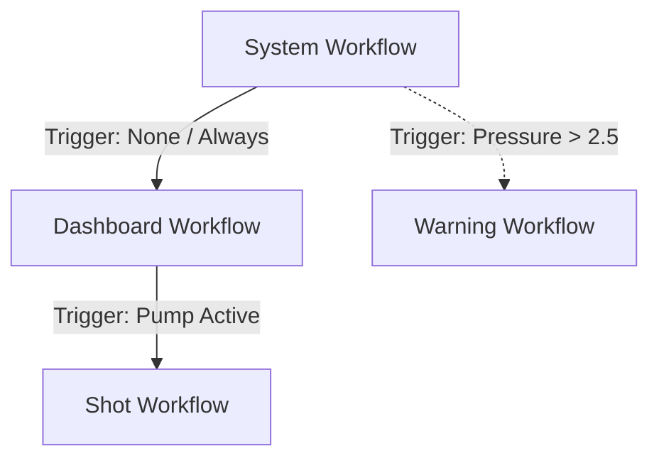

# Feature Planning: Hierarchical Workflow Tree (Issue #19)

## 1. Problem Statement
The current `WorkflowEngine` treats all workflows as a flat list of potential overrides governed by a single `precedence` value. This leads to several architectural "pain points":
- **Global Triggers**: Triggers are evaluated globally, allowing the `ShotWorkflow` to interrupt the `System Startup` sequence prematurely.
- **Lack of Context**: Workflows do not know their "Parent" or "Children," making it difficult to return to a previous state (e.g., returning to the Dashboard after a Shot).
- **Leaky Blockers**: "Blocker" screens (like Warming Up) only block their own workflow's progress, but do not prevent the engine from switching to a completely different triggered workflow.

## 2. Goal
Restructure the workflow management into a **Tree-based Hierarchy** where the `System` workflow is the root, and all other behaviors are branched from it.

### Core Requirements:
1.  **System-First Priority**: Root-level triggers (e.g., Boiler Pressure Warning) must always take precedence over the current active branch.
2.  **Branch-Scoped Triggers**: Triggers should only be evaluated if their parent node is the current active path.
3.  **Blocking Traversal**: If a node contains a "Blocker" screen that is not yet `done()`, the engine must halt traversal and not evaluate any child triggers.
4.  **Automatic Return**: When a child workflow's trigger becomes false, the focus should naturally return to the parent node.

---

## 3. Proposed Architecture

### A. The `WorkflowNode` Model
Instead of a flat list, we introduce a hierarchical node structure:

### B. Tree Traversal Logic
On every `update()`, the `WorkflowEngine` will:
1.  **Check System Triggers**: Evaluate a list of "Global Interrupts" defined at the Root.
    - If a match is found, switch to the Interrupt path.
2.  **Traverse from Root**: 
    - Start at the Root node.
    - If the current node's active screen is a **Blocker** and is NOT done: **STAY HERE** (Stop traversal).
    - If not blocked: Evaluate the `Triggers` of all immediate children in the order they were added.
    - If a child trigger is TRUE: Move the active focus to that child and repeat Traversal.
3.  **Return Path**: If the trigger that got us to the current child is now FALSE: Return to the Parent.

---

## 4. Proposed Amendments & Adjustments

### Amendment 1: "System" vs "Global" Triggers
The issue suggests that system triggers are aggregated. I propose a formal distinction:
- **Critical Interrupts (Global)**: High-priority events (e.g., Safety/Alarms) that can trigger from anywhere.
- **Branch Triggers**: Functional triggers (e.g., Pump -> Shot) that only exist when the machine is in a specific state (e.g., Dashboard).

### Clarification: Blocker Definition
We must clarify that a **Blocker** is a property of the `IScreen` or the `WorkflowNode`. If `isBlocking()` is true, children cannot be evaluated.

---

## 5. Verification & Visualization Plan
- **Hierarchical Visualization (Breadcrumbs)**: The simulator will be updated to render a "Contextual Breadcrumb" bar (e.g., `System > Dashboard > Shot`) at the top of each generated screenshot.
- **Native Tests**: Create a tree of `MockWorkflows` and verify that a blocker in the middle of the tree prevented a downstream trigger from activating.
- **Native Tests**: Verify that toggling a child trigger to false returns focus to the parent.
- **Simulator Tests**: Verify that the transition from Dashboard to Shot (and back) remains visually consistent.

---

## 6. Next Steps
1. **User Review**: Approve the Tree vs. List approach.
2. **Implementation Plan**: Define the `WorkflowNode` class and migration steps for `WorkflowEngine`.
