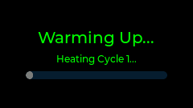

# Journey: System Startup

## Sequence of Events

| Step | Screen | Visualization | Exit Condition |
| :---: | :--- | :--- | :--- |
| 0 | **WiFi Setup** |  | _Wait for WiFi connection_ |
| 1 | **OTA Update Check** |  | _Wait for OTA check completion_ |
| 2 | **Warming Up** |  | _Wait for target temperature_ |
