# BoilerTemperature Documentation

Visualizing BoilerTemperature data.

## StatusWidget
| Theme | Low (25) | Init (25) | High (150) | Error | Scaled (Init) |
| :--- | :---: | :---: | :---: | :---: | :---: |
| Default |  |  |  |  |   |
| Candy |  |  |  |  |   |
| Christmas |  |  |  |  |   |

## SensorWidget
| Theme | Low (25) | Init (25) | High (150) | Error | Scaled (Init) |
| :--- | :---: | :---: | :---: | :---: | :---: |
| Default |  |  |  |  |   |
| Candy |  |  |  |  |   |
| Christmas |  |  |  |  |   |

## GaugeWidget
| Theme | Low (25) | Init (25) | High (150) | Error | Scaled (Init) |
| :--- | :---: | :---: | :---: | :---: | :---: |
| Default | 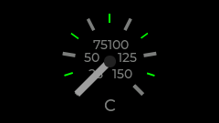 | 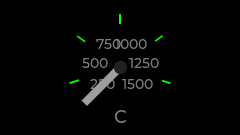 | 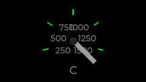 | 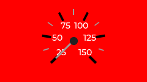 | 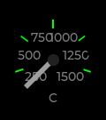  |
| Candy | 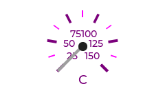 | 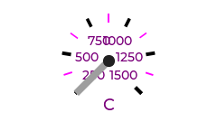 |  |  |   |
| Christmas | 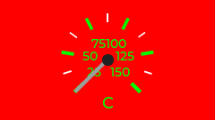 | 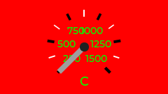 | 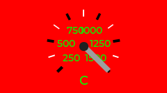 | 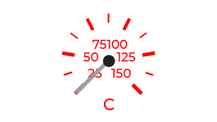 | 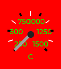  |

