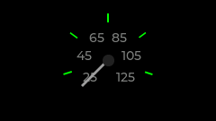
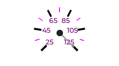
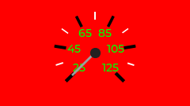

# BoilerTemperature Documentation

Visualizing BoilerTemperature data.

## StatusWidget
| Theme | Zero (25) | Max (125) | Error |
| :--- | :---: | :---: | :---: |
| Default |  |  |  |
| Candy |  |  |  |
| Christmas |  |  |  |

## SensorWidget
| Theme | Zero (25) | Max (125) | Error |
| :--- | :---: | :---: | :---: |
| Default |  |  |  |
| Candy |  |  |  |
| Christmas |  |  |  |

## GaugeWidget
| Theme | Zero (25) | Max (125) | Error |
| :--- | :---: | :---: | :---: |
| Default |  |  |  |
| Candy |  |  |  |
| Christmas |  |  |  |

