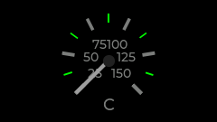
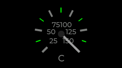
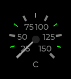
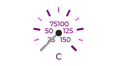
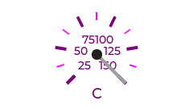
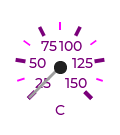
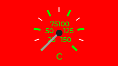
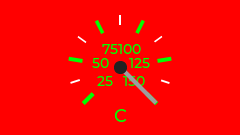
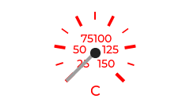
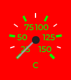

# BoilerTemperature Documentation

Visualizing BoilerTemperature data.

## Sensor
| Theme | Low (25) | Init (25) | High (150) | Error | Scaled (Init) |
| :--- | :---: | :---: | :---: | :---: | :---: |
| Default |  |  |  |  |   |
| Candy |  |  |  |  |   |
| Christmas |  |  |  |  |   |

## Gauge
| Theme | Low (25) | Init (25) | High (150) | Error | Scaled (Init) |
| :--- | :---: | :---: | :---: | :---: | :---: |
| Default |  |  |  |  |   |
| Candy |  |  |  |  |   |
| Christmas |  |  |  |  |   |

