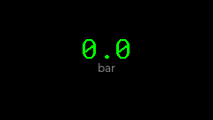
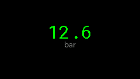
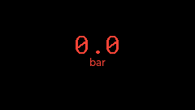

# Sensors & Widgets Examples

This directory contains examples for the various UI widgets used in the Fracino Cherub ShotTimer project. These examples are automatically verified and captured using a headless LVGL simulator.

## Available Widgets

### [StatusWidget](StatusWidget/README.md)
A textual status display with semantic coloring and message locking.

| Theme | Zero (Ready) | Max (Active) | Error |
| :--- | :---: | :---: | :---: |
| **Default** |  |  |  |

---

### [SensorWidget](SensorWidget/README.md)
A numerical data display with unit support and automatic precision.

| Theme | Zero Reading | Max Reading | Error |
| :--- | :---: | :---: | :---: |
| **Default** |  |  |  |

## How it Works (Macros & Templates)

The example framework uses two C++ features to minimize boilerplate: **Templates** and **Macros**.

### 1. The Template Base Class (`BaseWidgetExample<T>`)
Found in `IExample.h`, this class uses a template parameter `T` (the widget class) to handle all standard LVGL operations:
- **`createWidget`**: Automatically calls `_widget = new T()`.
- **`updateWidget`/`applyTheme`**: Standardizes how data and themes are pushed to the widget.
- **`getWidgetName`**: Returns the name stored during construction.

### 2. The `EXAMPLE_FOR` Macro
This macro simplifies the class definition using two preprocessor "tricks":

```cpp
#define EXAMPLE_FOR(WidgetClass) \
class WidgetClass##Example : public BaseWidgetExample<WidgetClass> { \
public: \
    WidgetClass##Example() : BaseWidgetExample(#WidgetClass) {}
```

- **`##` (Token Pasting)**: Combines `WidgetClass` and `Example`. If you pass `StatusWidget`, the compiler sees `StatusWidgetExample`.
- **`#` (Stringification)**: Converts the parameter into a string literal. `#WidgetClass` becomes `"StatusWidget"`, which is then used for naming the generated BMP files.

**Benefits**: Adding a new widget example now only requires defining the test states, ensuring consistency across the entire documentation gallery.

## Automated Verification
These snapshots are generated by the `simulator` target. To refresh them locally, run:

```bash
pio test -e simulator -f test_simulator
```

The simulator uses a headless driver to render widgets into a memory buffer and save them as BMP files, ensuring that documentation always reflects the latest UI code across all available themes.
