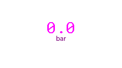
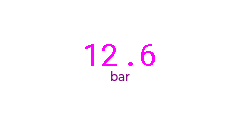
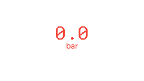
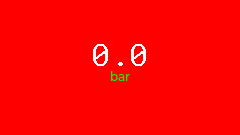
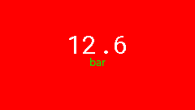
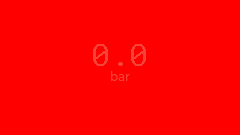

# SensorWidget Example

The `SensorWidget` is a data-oriented widget designed to display numerical sensor readings with units. It automatically handles decimal precision and switches to an error state (red text) if the sensor reports an error.

## Usage

```cpp
// Instantiate with a sensor
SensorWidget pressureWidget(factory.getPressureSensor());

// Initialize
pressureWidget.init(parent, 1, 1); 

// Theme support
pressureWidget.applyTheme(theme);
```

## Theme Gallery

| Theme | Zero Reading | Max Reading | Error |
| :--- | :---: | :---: | :---: |
| **Default** |  |  |  |
| **Candy** |  |  |  |
| **Christmas** |  |  |  |

## Features
- **Precision Control**: Displays the exact number of decimal places specified by the `Reading` object.
- **Unit Display**: Renders the unit (e.g., "bar", "g") in a smaller font below the value.
- **Error Handling**: Text color automatically turns red when `reading.isError` is true.
- **Efficient Updates**: Only refreshes the underlying LVGL objects when the data changes or `refresh()` is called.
