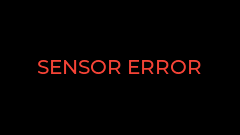
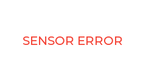
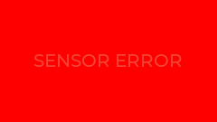

# StatusWidget Example

The `StatusWidget` is a textual display that shows semantic messages (e.g., "READY", "HEATING"). It supports semantic coloring, automatically switching to red when an error is reported by the underlying sensor.

## Usage

```cpp
// Instantiate with a sensor
StatusWidget statusWidget(factory.getAppStateSensor());

// Initialize
statusWidget.init(parent, 1, 1); 

// Theme support
statusWidget.applyTheme(theme);
```

## Theme Gallery

| Theme | Zero (Ready) | Max (Active) | Error |
| :--- | :---: | :---: | :---: |
| **Default** |  |  |  |
| **Candy** |  |  |  |
| **Christmas** |  |  |  |

## Features
- **Semantic Coloring**: Automatically uses the theme's label color or switches to red on error.
- **Message Locking**: When `update()` is called with a manual message, it remains on screen for 3 seconds to ensure readability.
- **Responsive Font**: Automatically scales text size based on the grid slot dimensions.
