# TaredWeight Documentation

Visualizing TaredWeight data.

## SensorWidget
| Theme | Low (-2000) | Init (0) | High (2000) | Error | Scaled (Init) |
| :--- | :---: | :---: | :---: | :---: | :---: |
| Default |  | 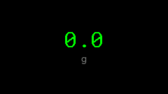 |  |  | 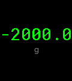 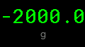 |
| Candy |  | 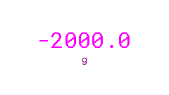 | 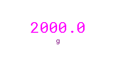 |  |   |
| Christmas |  |  | 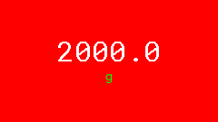 |  | 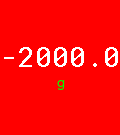  |

## GaugeWidget
| Theme | Low (-2000) | Init (0) | High (2000) | Error | Scaled (Init) |
| :--- | :---: | :---: | :---: | :---: | :---: |
| Default | 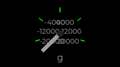 | 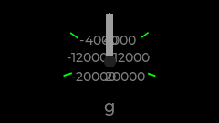 | 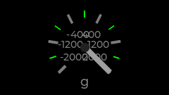 | 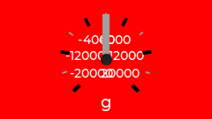 | 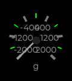  |
| Candy | 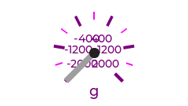 | 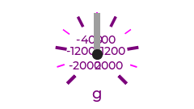 | 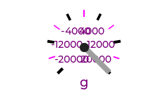 |  | 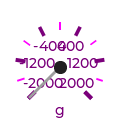 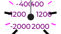 |
| Christmas | 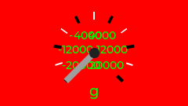 |  | 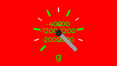 | 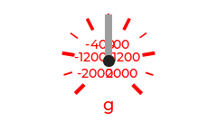 | 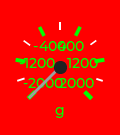  |

