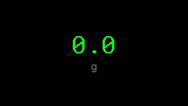
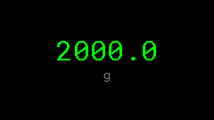
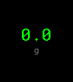
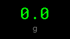
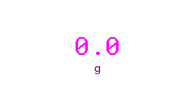
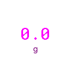
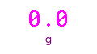
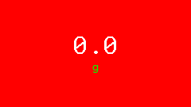
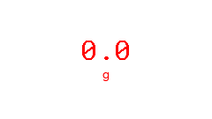
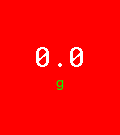

# WeightSensor Documentation

Visualizing WeightSensor data.

## Sensor
| Theme | Low (0) | Init (0) | High (2000) | Error | Scaled (Init) |
| :--- | :---: | :---: | :---: | :---: | :---: |
| Default |  |  |  |  |   |
| Candy |  |  |  |  |   |
| Christmas |  |  |  |  |   |

