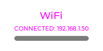

# WiFiBlocker Documentation

## BlockerWidget
| Theme | Pending | Active | Ready | Failed |
| :--- | :---: | :---: | :---: | :---: |
| Default |  |  |  |  |
| Candy |  |  |  |  |
| Christmas |  |  |  |  |
