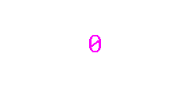

# WiFiSensor Documentation

Visualizing WiFiSensor data.

## StatusWidget
| Theme | Low (0) | Init (0) | High (1) | Error |
| :--- | :---: | :---: | :---: | :---: |
| Default |  |  |  |  |
| Candy |  |  |  |  |
| Christmas |  |  |  |  |

## SensorWidget
| Theme | Low (0) | Init (0) | High (1) | Error |
| :--- | :---: | :---: | :---: | :---: |
| Default |  |  |  |  |
| Candy |  |  |  |  |
| Christmas |  |  |  |  |

## GaugeWidget
| Theme | Low (0) | Init (0) | High (1) | Error |
| :--- | :---: | :---: | :---: | :---: |
| Default |  |  |  |  |
| Candy |  |  |  |  |
| Christmas |  |  |  |  |

