# WiFiSensor Documentation

Visualizing WiFiSensor data.

## StatusWidget
| Theme | Low (0) | Init (0) | High (1) | Error | Scaled (Init) |
| :--- | :---: | :---: | :---: | :---: | :---: |
| Default |  |  |  |  |   |
| Candy |  |  |  |  |   |
| Christmas |  |  |  |  |   |

## SensorWidget
| Theme | Low (0) | Init (0) | High (1) | Error | Scaled (Init) |
| :--- | :---: | :---: | :---: | :---: | :---: |
| Default |  |  |  |  |  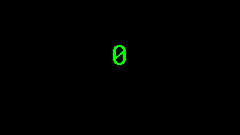 |
| Candy |  |  |  |  |   |
| Christmas |  |  |  |  |   |

## GaugeWidget
| Theme | Low (0) | Init (0) | High (1) | Error | Scaled (Init) |
| :--- | :---: | :---: | :---: | :---: | :---: |
| Default | 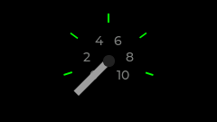 | 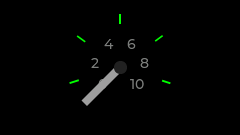 | 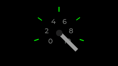 |  | 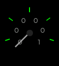 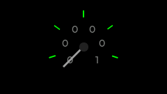 |
| Candy |  | 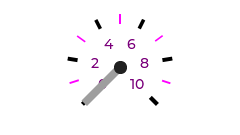 | 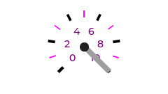 |  | 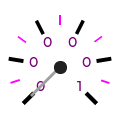  |
| Christmas | 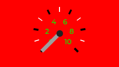 |  | 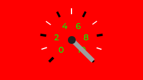 | 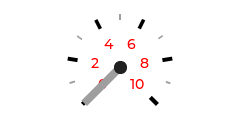 | 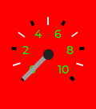  |

